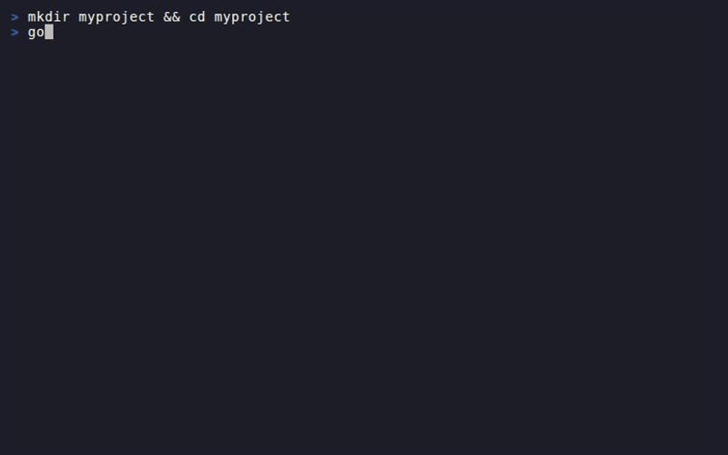

# goodvibes

> One command. Production-grade project. No config.

[](https://www.npmjs.com/package/@jgiox/goodvibes)
[](https://pypi.org/project/jgiox-goodvibes/)
[](https://github.com/jgiox/goodvibes/actions/workflows/ci.yml)
[](LICENSE)

[](docs/demo.gif)

## Quick start

```sh
npx goodvibes init
```

Or with Python:

```sh
pip install jgiox-goodvibes
goodvibes init
```

## What you get

`goodvibes init` copies four things into your project:

1. **CLAUDE.md** — Engineering rules that Claude reads automatically on every session: think before coding, simplicity first, fail loud, keep a journal, update tests
2. **caveman skill** — Compresses Claude's output so you get more done per context window
3. **ponytail rules** — Keeps code minimal; no over-engineering
4. **headroom** — Compresses what Claude reads, so context lasts longer (requires Python 3.10+; skipped gracefully if absent)

Running it a second time is safe — existing files are not overwritten, and CLAUDE.md is merged rather than replaced.

## Flags

```sh
goodvibes init --dry-run    # Preview files without writing anything
goodvibes init --minimal    # Skip headroom install, all .github/ files, and docs/
```

`--minimal` skips: `.github/` (workflows, issue templates, PR template, dependabot) and `docs/`.

## What you need first

| Requirement | Why | Install |
|-------------|-----|---------|
| **git** | Version control — goodvibes sets up git-friendly CI | [git-scm.com](https://git-scm.com/downloads) |
| **GitHub account** | Where your code lives; CI runs here | [github.com/signup](https://github.com/signup) |
| **Node.js 20+** | Required for `npx goodvibes init` (the npm CLI) | [nodejs.org](https://nodejs.org) |
| **Python 3.10+** | Required only for `pip install jgiox-goodvibes` (optional) | [python.org](https://python.org/downloads) |

**Windows users:** Use WSL2 for the best experience — install it from the Microsoft Store or with `wsl --install` in PowerShell.

## Platform support

| Platform | Status |
|----------|--------|
| Linux | ✓ Supported |
| macOS | ✓ Supported |
| WSL2 (Windows) | ✓ Supported |
| Windows (native) | Best-effort |

## Docs

- [docs/onboarding.md](docs/onboarding.md) — git and GitHub basics for complete beginners
- [CONTRIBUTING.md](CONTRIBUTING.md) — how to contribute
- [SECURITY.md](SECURITY.md) — reporting vulnerabilities
- [CHANGELOG.md](CHANGELOG.md) — what changed in each release
