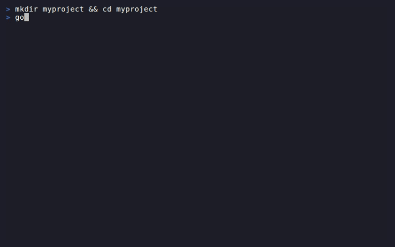

# goodvibes

**Guard rails for coding with AI. One command, no setup.**

[](https://www.npmjs.com/package/goodvibes-cli)
[](https://pypi.org/project/goodvibes-cli/)
[](https://github.com/jgiox/goodvibes/actions/workflows/ci.yml)
[](LICENSE)

```sh
npx goodvibes-cli init
```

[](docs/demo.gif)

## What is goodvibes?

AI coding assistants such as Claude Code, Cursor and Copilot write code fast. Left alone, they also:

- add more code than the task needs, and new libraries you did not ask for
- read whole files and long logs, which uses up the context window and your tokens
- say "done" without running the tests
- forget what was decided in earlier sessions
- open your `.env` file or run commands you would rather approve first

goodvibes fixes that with one command. It gives your AI tool a clear set of working rules, adds checks that stop the most common mistakes before they happen, and sets up GitHub so every change is tested automatically. You keep coding the way you do now.

It is free, open source (Apache 2.0) and works on its own: no account, no service, no API key.

## Who it is for

**New to coding?** You get the setup an experienced developer would build for you: tests that run on every change, a history of what was done and why, and an assistant that asks before it pushes, publishes or deletes. You do not need to understand any of it for it to work. The guides explain each piece when you are ready.

**Experienced?** You get a consistent rule set across 14 AI tools, Claude Code hooks and permissions tested under dash with mawk, BWK awk and busybox, CI templates with pinned actions and least-privilege tokens, and a CLI that merges into your existing config instead of overwriting it. Everything is plain files you can read, edit or delete.

## What you get

| Problem | What goodvibes does |
|---|---|
| The AI over-builds | Engineering rules and the **ponytail** minimalism ladder: smallest change that works, no new dependency for what a few lines can do, fail loud instead of hiding errors |
| Tokens and context run out | Claude reads big files a range at a time (**read guard**), replies are short from the first message (**caveman**, at its `ultra` level), what it reads is compressed (**headroom**), and **`goodvibes usage`** shows where your tokens went |
| "Done" without proof | The rules require passing tests, pasted output and updated docs before a task counts as done. A failing test comes before every bug fix |
| Each session starts from zero | **JOURNAL.md** keeps decisions across sessions and tools, and a commit that leaves it out is blocked, in every tool |
| Risky commands | Claude Code asks before `git push`, publishing, deploying or deleting branches, refuses force-push and `git reset --hard`, and will not open `.env` files, SSH keys or credential files |
| Outdated library knowledge | **context7** gives Claude Code, Cursor and VS Code (GitHub Copilot) current library docs. Free, no key |
| Nothing checks your work | GitHub workflows for tests, security scanning, secret scanning, dependency review and file size, plus Dependabot |

Everything works out of the box. Every piece can be turned off.

## Quick start

1. Install [git](https://git-scm.com/downloads) and [Node.js 22.12 or later](https://nodejs.org). Never used a terminal? Start with [docs/onboarding.md](docs/onboarding.md).
2. Open a terminal in your project folder (an empty folder is fine) and run:

   ```sh
   npx goodvibes-cli init
   ```

   Prefer Python? `pip install goodvibes-cli` (or `uv tool install goodvibes-cli`), then `goodvibes init`.
3. Open the folder in your AI coding tool and ask for what you want to build.

To check that everything is in place, run `goodvibes doctor`. [docs/getting-started.md](docs/getting-started.md) walks you through your first change.

## How it works

goodvibes works in three layers. Each one catches what the one before it missed.

| Layer | Where it runs | What it does |
|---|---|---|
| **1. Rules** | Every supported AI tool | Tells the AI how to work: plan first, keep changes small, test, record decisions, ask before risky steps |
| **2. Guard rails** | Claude Code; the journal check and the read guard also in Codex CLI, Gemini CLI, GitHub Copilot, Cursor, Devin CLI, Windsurf and Kiro | Hooks and permissions that stop a step before it happens: an unrecorded commit, a whole-file read of a huge file, a force-push, a peek at `.env` |
| **3. Checks** | GitHub | Workflows that test and scan every pull request, whichever tool or person wrote the code |

Rules guide, guard rails stop, checks verify. Claude Code gets everything. The tools in [Guard rails in other AI tools](#guard-rails-in-other-ai-tools) also get the journal check and the read guard; every other tool gets layers 1 and 3, plus the git commit check.

## What `goodvibes init` sets up

### For your AI tool

- **Engineering rules**, in `~/.claude/rules/goodvibes.md` for Claude Code (or this project's `CLAUDE.md` with `--scope project`), and as a rule file for each of 14 tools (see [Works with](#works-with)).
- **ponytail**, a minimalism ruleset: before writing code, check whether it needs to exist, whether the codebase or standard library already does it, and only then write the least code that works.
- **caveman**, a short reply style, on at its strongest level (`ultra`) from the first reply in every tool. It abbreviates prose, never code, commands or error messages. Too terse? Type `/caveman full` or `stop caveman` (in other tools, say "caveman full" or "stop caveman").
- **Skills** for Claude Code: `caveman` (the full style guide), `caveman-commit` and `caveman-review` (short commit messages and review comments), `goodvibes-hygiene` (on-demand over-engineering audits), and `model-regression` (a before-and-after gate whenever a change can move a model or a score).

### Guard rails in Claude Code

- **Journal check**: stops Claude Code before it runs a commit that leaves out `JOURNAL.md`. The git commit check (below) covers every tool that makes git commits.
- **Read guard**: reading a whole file over 800 lines or 100 KB is blocked with a pointer to read a range or search instead. `.env` files, SSH keys and credential files are blocked too, also in searches (Grep) and in patterns such as `cat .env*`. It is best-effort: it catches the usual ways to read a file, not every one. `GOODVIBES_READ_GUARD=off` turns it off.
- **Permissions**: see [What Claude Code can do without asking](#what-claude-code-can-do-without-asking).
- **Session check**: when Claude Code starts, `goodvibes doctor --quick` checks git, the rules and the journal size. It prints nothing unless something needs fixing.
- **context7**: current library docs, added to your Claude Code user settings (Cursor and VS Code get their own file, below).
- **headroom**: compresses what Claude reads. Needs Python 3.10 or later; skipped if Python is missing. The first install downloads a few gigabytes.

### Guard rails in other AI tools

The journal check and the read guard also run in these tools. Each file runs the exact same two scripts as Claude Code.

| Tool | File | Notes |
|---|---|---|
| OpenAI Codex CLI | `.codex/hooks.json` | Codex asks you once to trust the project's hooks before they run (a review screen at startup) |
| Gemini CLI | `.gemini/settings.json` | Hooks under `BeforeTool`. Gemini runs project hooks only in a trusted folder and shows a warning the first time it sees them |
| GitHub Copilot cloud agent, Copilot in VS Code | `.github/hooks/goodvibes.json` | Written with `--minimal` too |
| Devin CLI | `.devin/hooks.v1.json` | |
| Windsurf | `.windsurf/hooks.json` | Before a command and before a file read |
| Kiro | `.kiro/hooks/goodvibes.json` | |
| Cursor | none | Runs the hooks in `.claude/settings.json` while its "Include Third-Party Plugins, Skills, and Other Configs" setting is on (the default) |
| GitHub Copilot CLI | none | Runs the hooks in `.claude/settings.json` as well as `.github/hooks/goodvibes.json`, so each check runs twice (same result) |

The read guard understands each tool's own way of reading a file, for example a line range given as a start and an end line, and checks their search tools for secret files (Copilot `Grep`, Gemini CLI `grep_search` and `read_many_files`, Devin `grep`). The journal check ignores actions that carry no shell command, so it never blocks a file edit whose text happens to mention `git commit`.

Not covered: Cline (its hooks stop the whole task instead of one action), Antigravity (its hook format is not documented well enough to target), Continue (its hooks are not switched on yet), Amazon Q Developer CLI (discontinued, replaced by Kiro), and Replit, Bolt, Lovable, Base44 and ChatGPT (no hooks). The git commit check still covers the journal in every tool that makes git commits.

None of these tools were tested by running them: the file formats were checked against each tool's documentation or source code. The checks are POSIX sh scripts, so on Windows they may not run in tools other than Claude Code (unverified). The Copilot hook file sets only the `bash` field, so on Windows Copilot skips it rather than failing.

### In your project

- **Git commit check** in `.git/hooks/pre-commit`: blocks any commit that leaves out `JOURNAL.md`, from any AI tool or from you, so every change leaves a note. It lives in your local git folder and is never committed, so each person who clones runs `goodvibes update` once. It never replaces a pre-commit hook you already have. `git commit --no-verify` skips it once.
- **Journal check and read guard for other AI tools**: `.codex/hooks.json`, `.gemini/settings.json`, `.github/hooks/goodvibes.json`, `.devin/hooks.v1.json`, `.windsurf/hooks.json` and `.kiro/hooks/goodvibes.json`. See [Guard rails in other AI tools](#guard-rails-in-other-ai-tools).
- **context7 for Cursor and VS Code (GitHub Copilot)**: `.cursor/mcp.json` and `.vscode/mcp.json`, each holding only the context7 server, so those tools can look up current library docs too. Windsurf keeps its MCP servers outside the project, so you add context7 there yourself: see [Windsurf setup](docs/platform-setup/windsurf.md).
- `JOURNAL.md` (decision log), `CHANGELOG.md`, `CONTRIBUTING.md`, `SECURITY.md` and a `CLAUDE.md` with a project section for you to fill in.
- **GitHub workflows**: tests (Node, Python or both, matched to your project), CodeQL and gitleaks security scans, dependency review that accepts only permissive licences, and a file size check (new code files are at most 500 lines; files already bigger may not grow). Third-party actions and the gitleaks image are pinned to exact versions, tokens are read-only, and superseded runs are cancelled.
- **Dependabot** for your GitHub Actions, waiting 7 days before proposing a new release (add npm, pip or uv with one short block, see the getting-started guide), plus issue and pull request templates.
- **Guides** in `docs/`: getting started, git basics, and setup notes for each AI tool.

`goodvibes init --minimal` skips headroom, `docs/` and the CI files in `.github/` (workflows, scripts, Dependabot, issue and pull request templates). It still writes Copilot's rules (`.github/copilot-instructions.md`) and hooks (`.github/hooks/`). A project whose `.github/workflows/` already holds a `.yml` or `.yaml` file gets only `file-size.yml` from the goodvibes workflows. Running `init` again is safe: existing files are kept and `CLAUDE.md` is merged, not replaced.

## Commands

| Command | What it does |
|---|---|
| `goodvibes init` | Set goodvibes up. `--scope project` keeps everything in this folder, `--minimal` skips headroom, `docs/` and the CI files in `.github/` (Copilot's rules and hooks are still added), `--dry-run` shows what would be written |
| `goodvibes doctor` | Check git, headroom, the rules, the journal and your MCP servers. Each line is ✓ fine, ! warning or ✗ problem, and it exits with an error only for problems |
| `goodvibes update` | Bring your goodvibes files up to date with the installed version. It shows the full plan and asks once. `--dry-run` only shows it |
| `goodvibes upgrade` | Install the newest goodvibes, then run `update` |
| `goodvibes usage` | Tokens used by recent Claude Code sessions in this project: input, output, cache hits and peak context. `--all`, `--days N`, `--json`. Offline, reads Claude Code's local logs |
| `goodvibes --version` | Show the installed version |

## Updating

`goodvibes upgrade` gets the newest version and updates your files in one step. `goodvibes update` updates your files to the version you already have. Run in a folder with no goodvibes setup (and no global setup in `~/.claude`), `upgrade` installs the new version and tells you how to update a project: go into its folder and run `goodvibes update` (for a new project, `goodvibes init`).

- Files you never edited are replaced with the new version. Files you edited are left alone.
- `.claude/settings.json`, `.gemini/settings.json`, `.codex/hooks.json`, `.mcp.json`, `.cursor/mcp.json` and `.vscode/mcp.json` are merged: goodvibes refreshes only its own entries (the journal check, the read guard, the ask and deny rules, context7) and keeps everything you added.
- The other tools' hook files (`.github/hooks/goodvibes.json`, `.devin/hooks.v1.json`, `.windsurf/hooks.json`, `.kiro/hooks/goodvibes.json`) are added if missing and left alone if you already have one.
- Anything goodvibes added that you deleted stays deleted. `goodvibes init` brings deleted files back if you want them.
- Skills goodvibes no longer ships are removed, unless you edited them.
- The git commit check is refreshed; if you deleted `.git/hooks/pre-commit`, it stays deleted.
- goodvibes never writes through a symlink. If the goodvibes block in your `CLAUDE.md` is damaged, it leaves the file alone and tells you how to fix it.

## What Claude Code can do without asking

In a goodvibes project, Claude Code runs these without a prompt: reading and editing files, `git add`, `git commit`, `git status`, `git diff`, `git log`, `git show`, `git branch`, `git stash`, `git fetch`, and your tests (`npm test`, `pytest`, `uv run pytest`, `python -m pytest`).

It asks first before:

- `git push`, publishing (`npm publish`, `twine upload` and others) and deploying (`wrangler`, `netlify`, `firebase`, `npm run deploy`)
- `git restore`, deleting a branch or stash, `git clean`, `--force-with-lease`
- editing its own guard rails: `.claude/settings.json`, `.claude/settings.local.json`, the MCP server files (`.mcp.json`, `.cursor/mcp.json`, `.vscode/mcp.json`), `.claude/hooks/`, and the other tools' hook files (`.codex/hooks.json`, `.gemini/settings.json`, `.github/hooks/`, `.devin/hooks.v1.json`, `.windsurf/hooks.json`, `.kiro/hooks/`), so an agent cannot quietly turn the checks off for another tool
- any other command, including installing packages and running `node`, `python`, `npx` or `uv`

It refuses:

- force-push (`--force`, `-f`, `+branch`, anywhere in the command) and `git reset --hard`
- opening `.env` files in any folder, such as `.env.local`, `.env.production` or `apps/web/.env` (`.env.example` stays readable), anything in `~/.ssh`, `~/.aws/credentials`, `~/.git-credentials`, `~/.netrc`, and `.pem`, `id_rsa`, `id_ed25519`, `id_ecdsa` or `id_dsa` key files

These rules cover Claude Code's own file tools. The read guard covers the same secret files when Claude tries `cat .env` or similar in the terminal. Hooks and permissions are a safety net for honest mistakes, not a security boundary.

Versions up to 1.9.1 also auto-approved `node`, `python`, `npx`, `uv`, `npm run` and package installs. Any command can run through those, so `goodvibes update` removes exactly those rules from your project settings and keeps the ones you wrote. It also removes `Write(**)`, which Claude Code ignores (`Edit(**)` already covers writing files).

In projects set up with version 1.10.0 or earlier, `goodvibes update` removes the old deny rules `Bash(git push --force*)` and `Bash(git push * --force*)`, which also matched `--force-with-lease`, so Claude Code asks instead of refusing. If you added one of those rules yourself, update leaves it, and `--force-with-lease` stays refused until you delete it.

## Global or one project

By default, `goodvibes init` sets goodvibes up for every project on your computer, then adds the project files to the current folder:

| Where | What |
|---|---|
| Your computer | The `goodvibes` command, installed globally (npm, or `uv tool` for Python), so the session check can run |
| `~/.claude/rules/goodvibes.md` | The engineering rules, loaded by Claude Code in every project |
| `~/.claude/skills/` | caveman, goodvibes-hygiene, model-regression and the other skills |
| `~/.claude/settings.json` | The journal check, the read guard, the session check, and the ask and deny rules. Your own settings are kept, and goodvibes never adds "allow" rules here |
| Claude Code user MCP settings | context7 |
| This folder | `JOURNAL.md`, `CHANGELOG.md`, CI workflows, rule files for other AI tools, context7 for Cursor and VS Code (`.cursor/mcp.json`, `.vscode/mcp.json`), hook files for other AI tools (see [Guard rails in other AI tools](#guard-rails-in-other-ai-tools)), `.claude/settings.json`, and a `CLAUDE.md` with a project section to fill in |

In your other projects, Claude Code then asks before pushing, publishing or deploying, refuses force-push, `git reset --hard` and secret files, and reads big files in ranges. The journal check acts only in repos that have a `JOURNAL.md`, and the session check stays quiet outside goodvibes projects. Run `goodvibes init` inside a project folder, never in your home folder: there the default setup does the global part only, and `--scope project` would put the project files straight into your home folder. Inside your Claude Code settings folder (`~/.claude`, or `CLAUDE_CONFIG_DIR` if you set it) `init` also does the global part only, and `--scope project` stops with an error.

To keep everything inside one project instead:

```sh
npx goodvibes-cli init --scope project
```

The only thing outside the project is headroom: it is installed on your computer and registered in your Claude Code user settings. `--minimal` skips it.

To undo the global part, delete `~/.claude/rules/goodvibes.md` and the goodvibes skills in `~/.claude/skills/`, remove the goodvibes entries from `~/.claude/settings.json`, and run `claude mcp remove context7 -s user`. `goodvibes update` does not put back anything you removed.

## Works with

`goodvibes init` writes the same rules for each tool, in the file that tool reads automatically.

| Tool | File | Notes |
|---|---|---|
| Claude Code | `~/.claude/rules/goodvibes.md`, or `CLAUDE.md` with `--scope project` | Also gets the hooks, permissions, skills and MCP servers |
| Cursor | `.cursor/rules/goodvibes.mdc` | 0.45 or later; `alwaysApply: true`. context7 in `.cursor/mcp.json`. Runs the journal check and the read guard from `.claude/settings.json` |
| GitHub Copilot | `.github/copilot-instructions.md` | VS Code Copilot Chat. If it does not apply, check that `github.copilot.chat.codeGeneration.useInstructionFiles` is on. context7 in `.vscode/mcp.json`. Hooks in `.github/hooks/goodvibes.json` |
| Windsurf | `.windsurfrules` | Every Cascade conversation. context7 is a manual step: see [Windsurf setup](docs/platform-setup/windsurf.md). Hooks in `.windsurf/hooks.json` |
| Devin Desktop | `.devin/rules/goodvibes.md` | Every conversation |
| Kiro | `.kiro/steering/goodvibes.md` | `inclusion: always`. Hooks in `.kiro/hooks/goodvibes.json` |
| Antigravity | `GEMINI.md` | Every session |
| Cline | `.clinerules/goodvibes.md` | Every conversation |
| Amazon Q Developer | `.amazonq/rules/goodvibes.md` | VS Code and JetBrains |
| Continue.dev | `.continue/rules/goodvibes.md` | Every request |
| OpenAI Codex CLI | `AGENTS.md` | Read from the project root. Hooks in `.codex/hooks.json` |
| Zed, Aider, JetBrains Junie and others | `AGENTS.md` | Any tool that reads `AGENTS.md` |
| Lovable | `AGENTS.md` and `CLAUDE.md` | Read from the repo root |
| Replit Agent | `replit.md` | Read from the project root |
| Bolt.new | `.bolt/prompt` | Read when the project opens |

The hooks in this table are the journal check and the read guard. Gemini CLI and Devin CLI get them too. See [Guard rails in other AI tools](#guard-rails-in-other-ai-tools).

`/ponytail-review`, `/ponytail-audit` and the other slash commands work only in the Claude Code terminal. In other tools the rules still apply; only the commands are missing.

## Requirements

| You need | Why |
|---|---|
| [git](https://git-scm.com/downloads) | Version history; goodvibes sets up git-based checks |
| [Node.js](https://nodejs.org) 22.12 or later | For `npx goodvibes-cli`. Not needed if you install with Python |
| [Python](https://python.org/downloads) 3.10 or later | Optional: for the Python install and for headroom |
| A [GitHub](https://github.com/signup) account | Optional: where your code lives and the checks run |

Linux, macOS and Windows through WSL2 are supported. Native Windows works on a best-effort basis; to install WSL2, run `wsl --install` in PowerShell.

## Privacy

`goodvibes init` sends one anonymous install count: an empty request with a random ID made fresh for that run. Nothing about you, your machine or your code is included, though like any web request the server sees your IP address. It is skipped in CI (when `CI` is set to anything other than `0` or `false`). To turn it off, set `DO_NOT_TRACK=1` (or `true`, `yes`) or `GOODVIBES_NO_TELEMETRY=1`. The counter has no accounts or keys, so its totals are approximate.

`goodvibes usage` and `goodvibes doctor` never send anything.

## Docs

- [Getting started](docs/getting-started.md): your first change, and what each piece does
- [Git and GitHub basics](docs/onboarding.md): for complete beginners
- [FAQ](FAQ.md): common questions and fixes
- Setup notes for [Cursor](docs/platform-setup/cursor.md), [Windsurf](docs/platform-setup/windsurf.md), [Kiro](docs/platform-setup/kiro.md), [Replit](docs/platform-setup/replit.md), [Bolt.new](docs/platform-setup/bolt.md), [ChatGPT Projects](docs/platform-setup/chatgpt.md) and [Base44](docs/platform-setup/base44.md)
- [Changelog](CHANGELOG.md), [Contributing](CONTRIBUTING.md), [Security policy](SECURITY.md)

## License

Apache 2.0. goodvibes includes the caveman skill and the ponytail rules (both MIT) and a file size check adapted from block/buzz (Apache 2.0). headroom is installed separately and is Apache 2.0. See [NOTICE](NOTICE).
